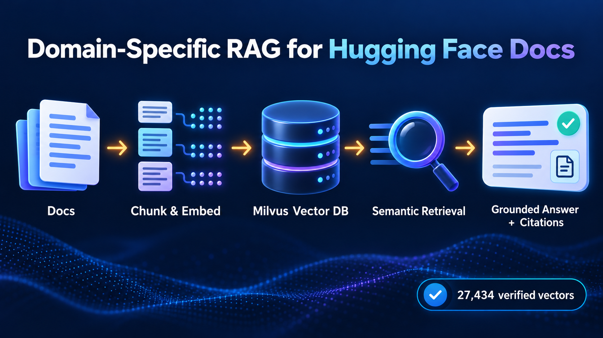

# Domain-Specific RAG for Hugging Face Documentation

This project implements an end-to-end Retrieval-Augmented Generation (RAG) system for answering technical questions about Hugging Face workflows. It ingests the Hugging Face documentation corpus, preserves source lineage during chunking, creates normalized semantic embeddings, stores them in Milvus Lite, retrieves relevant evidence, and generates context-grounded answers with citations.

The complete implementation and its recorded outputs are contained in [`notebooks/domain_specific_rag.ipynb`](notebooks/domain_specific_rag.ipynb).

## Architecture



The online query path is:

```text
User question
    -> normalized BGE query embedding
    -> Milvus inner-product search
    -> ranked top-k chunks with source lineage
    -> retrieval-score filtering
    -> grounded Qwen prompt
    -> answer, citations, and diagnostic metadata
```

The offline indexing path is:

```text
Hugging Face documentation
    -> validation and normalization
    -> sliding-window chunks
    -> batched normalized BGE embeddings
    -> batched Milvus insertion
    -> full primary-key and metadata verification
```

## Key Results

| Checkpoint | Result |
|---|---:|
| Source documents | 2,647 |
| Sliding-window chunks | 27,434 |
| Average chunks per document | 10.36 |
| Chunk size / overlap | 1,000 / 200 characters |
| Embedding model | `BAAI/bge-small-en-v1.5` |
| Embedding dimension | 384 |
| Embedding normalization | L2 unit norm |
| Vector database | Milvus Lite |
| Similarity metric | Inner Product (`IP`) |
| Verified Milvus records | 27,434 |
| Generation model | `Qwen/Qwen2-1.5B-Instruct` |
| Evaluation | Precision@k, Recall@k, Opik relevance and hallucination |

## Process Followed

### Stage 1: Chunking the Knowledge Base

1. Loaded the full [`m-ric/huggingface_doc`](https://huggingface.co/datasets/m-ric/huggingface_doc) training split.
2. Inspected document count, source paths, missing values, duplicates, and document-length distribution.
3. Normalized document text once so saved character offsets map exactly to the stored source text.
4. Applied deterministic sliding-window chunking:
   - `chunk_size = 1000`
   - `chunk_overlap = 200`
   - `step_size = 800`
5. Attached complete lineage to every chunk:
   - `chunk_id`
   - `document_id`
   - `chunk_index`
   - `character_start`
   - `character_end`
   - `source`
6. Verified that every metadata span reconstructs the exact chunk text.

### Stage 2: Vectorizing and Storing Knowledge

1. Loaded `BAAI/bge-small-en-v1.5`, which produces compact 384-dimensional English retrieval embeddings.
2. Encoded chunks in batches to keep memory usage bounded.
3. Requested `normalize_embeddings=True` and explicitly reapplied NumPy L2 normalization.
4. Asserted that every embedding has unit norm, allowing inner product to behave like cosine similarity.
5. Created an idempotent Milvus Lite collection with:
   - Integer primary key
   - 384-dimensional `FLOAT_VECTOR`
   - `IP` similarity
   - Strong consistency
   - Dynamic metadata fields
6. Inserted vectors and metadata in batches.
7. Confirmed ingestion using three independent checks:
   - Sum of Milvus batch acknowledgements
   - Persisted collection row count
   - Batched read-back of every expected primary key
8. Checked for missing, unexpected, or duplicate IDs and compared representative stored metadata with the original chunks.

### Stage 3: Retrieving Relevant Context

1. Applied the BGE query instruction and the same normalized embedding process used during indexing.
2. Searched Milvus using a caller-configurable `top_k` and the matching `IP` metric.
3. Returned ranked text, source path, chunk ID, character offsets, and similarity score.
4. Validated that query vectors have unit norm and that retrieved records include both text and source provenance.

### Stage 4: Grounded Answer Generation

1. Formatted retrieved chunks as numbered evidence blocks.
2. Used an explicit system prompt that requires the model to:
   - Answer only from supplied context
   - Avoid unsupported facts
   - Cite numbered sources
   - Return a fixed insufficient-information response when evidence is inadequate
3. Filtered weak evidence with a calibrated retrieval-score threshold.
4. Used deterministic Qwen decoding for reproducible answers.
5. Retried malformed citations once and used an auditable deterministic citation footer when only formatting failed.
6. Preserved genuine refusal behavior for unsupported queries.
7. Added pipeline-trace checks proving that the exact retrieved chunks were passed into generation context.

### Stage 5: Automated Evaluation and Diagnosis

Retrieval and generation are evaluated separately so failures can be attributed to the correct stage.

#### Retrieval evaluation

- Built a document-anchored labeled test set independent of vector-search results.
- Calculated precision and recall at `k = 1, 3, 5`.
- Reported per-query and macro-average results.
- Diagnosed weak retrieval using labels, ranked IDs, scores, and recall.

#### Generation evaluation

- Used Opik `AnswerRelevance` and `Hallucination` metrics.
- Passed the exact context used for generation into each metric.
- Calibrated the local judge with one supported and one deliberately unsupported answer.
- Marked hallucination scores as diagnostic when the small local judge failed calibration.
- Classified failures as:
  - Retrieval or chunking
  - Generation relevance
  - Grounding
  - Citation formatting
  - Metric execution
  - Evaluator reliability

### Stage 6: Rigor and Reproducibility

- Fixed random seeds for Python, NumPy, and PyTorch.
- Used deterministic generation (`do_sample=False`).
- Added type hints, docstrings, assertions, and stage checkpoints.
- Kept `top_k`, retrieval threshold, answer length, and context count configurable.
- Read the optional Hugging Face credential from `HF_TOKEN`; no credential is hardcoded.
- Used portable artifact paths for Colab and local execution.
- Printed package versions and a final reproducibility manifest.
- Added explicit acceptance thresholds and per-case diagnostics.

## Repository Layout

```text
huggingface-domain-specific-rag/
|-- notebooks/
|   `-- domain_specific_rag.ipynb     # Complete implementation and evaluation
|-- data/
|   |-- domain_based_rag.png          # Architecture diagram
|   `-- raw/                          # Downloaded corpus; ignored by Git
|-- artifacts/
|   `-- local_checkpoint/
|       `-- README.txt                # Description of generated checkpoints
|-- Dockerfile                        # Reproducible CPU container
|-- requirements-local.txt            # Bounded Python dependencies
|-- instructions.md                   # Local and Docker notes
|-- .gitignore                        # Excludes datasets, models, and generated DB files
`-- README.md
```

Generated embeddings, Parquet files, model caches, and the Milvus database are intentionally excluded from Git because they are large, reproducible, and may contain token-like strings copied from upstream documentation.

## Running in Google Colab

1. Upload or open `notebooks/domain_specific_rag.ipynb` in Colab.
2. Select a GPU runtime when available. CPU execution is supported but generation and embedding will be considerably slower.
3. If authenticated Hugging Face downloads are required, set `HF_TOKEN` securely in the environment or Colab secrets.
4. Select **Runtime -> Restart session and run all**.
5. Confirm that all assertions and validation checkpoints pass.
6. Download the executed notebook using **File -> Download -> Download .ipynb**.

## Running Locally on Windows

Python 3.12 is recommended.

```powershell
py -3.12 -m venv .venv
Set-ExecutionPolicy -Scope Process -ExecutionPolicy Bypass
.\.venv\Scripts\Activate.ps1
python -m pip install --upgrade pip
python -m pip install -r requirements-local.txt
python -m jupyter lab notebooks\domain_specific_rag.ipynb
```

An optional Hugging Face token should be supplied through the environment:

```powershell
$env:HF_TOKEN = "your-token"
```

Never place the real token in the notebook, source code, output cells, or Git history.

## Running with Docker

Build the CPU image:

```powershell
docker build -t hf-domain-rag-cpu .
```

Start the container with the repository and a persistent Hugging Face model cache mounted:

```powershell
docker run --rm -it `
  -p 8888:8888 `
  -v "${PWD}:/workspace" `
  -v hf-model-cache:/root/.cache/huggingface `
  hf-domain-rag-cpu bash
```

Inside the container, launch Jupyter:

```bash
python -m jupyter lab \
  --ip=0.0.0.0 \
  --port=8888 \
  --no-browser \
  --allow-root
```

## Generated Checkpoints

The notebook directly writes the embedding checkpoint and Milvus database beneath `artifacts/local_checkpoint/` during a local run. The existing local checkpoint bundle also includes exported chunk metadata and configuration:

| Artifact | Purpose |
|---|---|
| `bge_chunk_embeddings.npy` | Normalized `(27434, 384)` embedding matrix written by the notebook |
| `hf_docs_milvus_clean.db/` | Persistent Milvus Lite collection and index written by the notebook |
| `chunks.parquet` | Exported chunk text and source-lineage metadata in the checkpoint bundle |
| `rag_configuration.json` | Exported pipeline and model configuration in the checkpoint bundle |

These files are runtime outputs and should not be committed.

## Design Trade-offs

- **Character windows:** Fast and deterministic, but may split sentences or code blocks. A production iteration should compare token- or sentence-aware chunking against the same labeled set.
- **Small BGE encoder:** Reduces storage and latency, while a larger embedding model may improve recall.
- **Milvus Lite:** Simplifies local persistence and testing; a managed or distributed Milvus deployment is more appropriate for concurrent production traffic.
- **Qwen 1.5B:** Fits common Colab hardware, but larger instruction models generally follow grounding and citation requirements more reliably.
- **Two-chunk context limit:** Controls latency and distractors, but may omit complementary evidence for multi-part questions.
- **Local LLM judge:** Avoids an external evaluation API, but must be calibrated because a small judge can produce inconsistent score/reason pairs.

## Security Notes

- Dataset and generated artifact directories are ignored by Git.
- Do not bypass GitHub push protection for detected credentials.
- Revoke and rotate any token that is accidentally printed or committed.
- Commit only source code, the notebook, documentation, and small reproducibility metadata.

## Final Submission Checklist

1. Restart the runtime and run the notebook from top to bottom.
2. Confirm that no cell contains an exception or stale output.
3. Review chunk counts, vector norms, Milvus record verification, retrieval metrics, Opik results, and failure diagnosis.
4. Save and download the freshly executed `.ipynb` notebook.
5. Upload that `.ipynb` file to the Scaler Business Case platform.

## License

This repository is distributed under the terms in [`LICENSE`](LICENSE).
